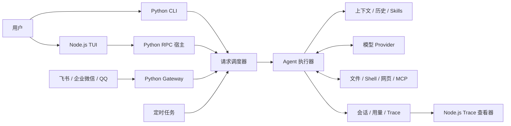

# Pico

[](https://github.com/yangaobo0235/pico-harness/actions/workflows/ci.yml)
[](LICENSE)

面向本地任务和消息渠道的 Python + Node.js AI 助手运行程序，连接大模型、组装上下文并执行工具，提供终端交互、会话管理、定时任务和执行记录查看。

你可以在代码仓库中让它分析调用链，通过飞书发送任务，或安排周期任务。Python 负责 Agent 执行和状态管理，Node.js 负责终端界面与 Trace 查看器，所有入口共用同一套模型与工具执行机制。

## 核心能力

- 通过 CLI 和终端界面接收任务，支持单次请求、持续对话和会话恢复。
- 连接配置的模型 Provider，支持原生适配及 OpenAI 兼容端点。
- 执行文件读写、搜索、Shell、网页和 MCP 工具，将工具结果送回模型继续处理。
- 按会话调度请求，处理排队、取消、并发和定时任务。
- 根据上下文预算选择历史、本地技能和可选记忆，控制单次请求的迭代上限。
- 接入飞书、企业微信和 QQ，通过 Gateway 持续接收消息并交付回复。
- 保存对话、调用用量和 Trace，提供浏览器中的执行记录查看器。
- 通过插件协议扩展工具和长期记忆能力。

当前公开版本不附带外部长期记忆实现。首次配置使用 `--skip-memory`；会话保存、上下文管理和本地技能仍可使用。

## 系统架构



## Python 与 Node.js 职责

| 能力 | 所有者 | 说明 |
| --- | --- | --- |
| CLI、RPC 和消息 Gateway | Python | 接收输入、适配协议和交付结果 |
| 调度、模型调用和工具执行 | Python | 统一 Agent 运行时，维护取消与执行限制 |
| 上下文、会话、技能和记忆协议 | Python | 组装模型输入并保存运行状态 |
| 模型、渠道、MCP 和执行器适配 | Python | 连接外部服务与执行环境 |
| 终端界面 | Node.js / TypeScript | 显示对话、工具事件和交互状态 |
| Trace 查看器 | Node.js / JavaScript | 读取调用记录并在浏览器展示 |

TUI 通过本机 RPC 与 Python 宿主通信。模型调用和工具副作用由 Python 运行时处理。

## Agent 请求流程

```text
用户输入 / 渠道消息 / 定时任务
  -> 创建统一请求，确定来源和会话
  -> 调度器按会话排队并控制并发
  -> 组装规则、历史、技能和本轮输入
  -> 调用模型，执行模型提出的工具请求
  -> 将工具结果加入上下文，继续模型与工具循环
  -> 得到回复、被取消或达到执行限制
  -> 保存会话与调用记录，向原入口交付结果
```

一次请求可以包含多次模型调用。同一会话的任务串行执行，其他会话按并发限制运行。

## 技术栈

| 分类 | 技术 |
| --- | --- |
| Python 运行时 | Python 3.12、asyncio、Typer、Pydantic |
| 模型与外部协议 | LiteLLM、原生 Provider、HTTPX、MCP |
| 终端界面 | Node.js 22、TypeScript、React、Ink、Nanostores |
| 状态与调度 | 文件持久化、Portalocker、Croniter |
| 执行环境 | 主机执行器、可选 Boxlite Sandbox |
| 执行记录 | 内置 Trace、Token 用量与成本计量、Node.js 查看器 |
| 测试与质量 | Pytest、Ruff、Vitest、ESLint、TypeScript、GitHub Actions |
| 依赖与构建 | uv、npm、Hatchling、esbuild |

## 项目结构

```text
pico-harness/
|-- .github/                 # CI、Issue 表单与 PR 模板
|-- src/pico/                # Python 产品代码
|   |-- interfaces/          # CLI、RPC 和 Gateway
|   |-- bootstrap/           # 服务与 Provider 装配
|   |-- runtime/             # Agent、上下文、调度、会话和交付
|   |-- capabilities/        # 工具、技能、记忆与自动化
|   |-- integrations/        # 模型、渠道、MCP、执行器与插件
|   |-- config/              # 配置模型、加载和状态路径
|   |-- contracts/           # 请求、消息与事件
|   |-- observability/       # Trace 和调用用量
|   |-- security/            # 权限与授权策略
|   |-- extensions/          # 运行时评估与改进实验
|   |-- resources/           # 内置模板、技能和打包资源
|   `-- shared/              # 基础算法、路径、锁和原子 IO
|-- apps/tui/                # 终端界面
|-- apps/tracing-viewer/     # 浏览器 Trace 查看器
|-- tests/                   # 单元、契约、集成和工程测试
|-- benchmarks/              # 能力评测与任务输入
|-- scripts/                 # CI、开发、安装和发行脚本
|-- examples/                # 配置与工作流示例
|-- docs/                    # 安装、使用、配置、架构、测试和排障
|-- LICENSES/                # 第三方许可证原文
`-- README.md
```

`.venv`、`.idea`、`.pico`、缓存和生成报告属于本地环境或运行数据，不进入 Git 仓库。

## 环境要求

- Python 3.12
- Node.js 22 与 npm，供 TUI 和 Trace 查看器使用
- uv 与 Git，供源码安装和开发使用
- 可用的模型服务及对应凭证
- 可选：消息平台应用、MCP 服务、支持所选平台的 Sandbox 执行器

基础使用不需要部署额外的数据库或消息队列。模型可以连接远程服务，也可以选择配置的本地 Provider。

## 快速开始

### 1. 获取代码

```powershell
git clone https://github.com/yangaobo0235/pico-harness.git
Set-Location pico-harness
```

### 2. 安装依赖并构建 TUI

```powershell
uv sync --frozen --extra dev --extra channels
npm ci
npm ci --prefix apps/tui
npm run build:tui
uv run pico --version
```

`channels` 安装飞书、企业微信和 QQ 的依赖；仅使用 CLI/TUI 可以省略该 extra。

### 3. 配置模型

```powershell
uv run pico onboard --skip-memory
```

向导选择 Provider、模型、凭证及运行环境，默认执行首次真实请求。使用 `--skip-test` 可以跳过该请求，之后通过 `uv run pico doctor --probe` 验证连接。

### 4. 启动助手

打开 TUI：

```powershell
uv run pico
```

执行单次任务：

```powershell
uv run pico run -m "阅读 README 和入口文件，说明这个项目做什么"
```

以上命令在当前目录工作。需要在其他项目直接使用 `pico` 时，可在本仓库安装独立命令：

```powershell
uv tool install ".[channels]"
```

进入目标项目后运行 `pico` 或 `pico run -m "..."`。具体安装方式、工作目录和 IDE 配置见[安装指南](docs/getting-started/installation.md)。

## 运行入口

以下示例在源码环境中使用 `uv run`；独立安装后可直接调用 `pico`。

| 入口 | 命令 | 用途 |
| --- | --- | --- |
| TUI | `uv run pico` | 终端对话与工具交互 |
| CLI | `uv run pico run -m "..."` | 单次任务或脚本调用 |
| 会话恢复 | `uv run pico run --continue` | 继续最近的 CLI 对话 |
| Gateway | `uv run pico gateway --workspace /path/to/workspace` | 持续接收消息渠道任务 |
| 模型诊断 | `uv run pico doctor --probe` | 验证真实模型连接 |
| Trace 查看器 | `uv run pico tracing` | 在浏览器查看执行记录 |

Gateway 需要配置启用的渠道并持续运行。显式 `--workspace` 会在该目录保存项目状态，长期运行可选择仓库外的专用目录。

## 测试

Python：

```powershell
uv run ruff check src scripts tests benchmarks hatch_build.py
uv run pytest tests -n 4 -q --strict-markers
```

TUI：

```powershell
npm run lint:tui
npm run typecheck:tui
npm run test:tui
npm run build:tui
```

CI 配置覆盖 Ubuntu 和 Windows，包含 Python 静态检查与回归、架构和文档检查、前端类型与 RPC 检查、TUI 测试及发行包构建。完整本地命令和真实环境测试见[测试指南](docs/development/testing.md)。

## 运行与安全说明

- 模型请求可能产生费用；凭证保存在本地配置中。
- 文件访问边界由工具配置控制，命令执行环境由执行器和 Sandbox 配置决定。
- 消息渠道通过配置的发送者和群消息规则接收任务。
- 插件属于可执行代码，部署者应控制插件来源。
- 个人会话、Trace、原始评测输出和密钥不提交到 Git。
- 安全问题按[安全报告流程](SECURITY.md)私下提交。

## 更多文档

- [安装与首次运行](docs/getting-started/installation.md)
- [使用指南](docs/guides/usage.md)
- [配置参考](docs/reference/configuration.md)
- [架构与函数归属](docs/architecture/overview.md)
- [测试指南](docs/development/testing.md)
- [故障排查](docs/guides/troubleshooting.md)
- [Benchmark 使用说明](benchmarks/README.md)
- [贡献指南](CONTRIBUTING.md)

## License

本项目使用 [Apache License 2.0](LICENSE)。第三方版权和许可证见[第三方声明](NOTICES.md)。项目处于 pre-1.0 阶段。
