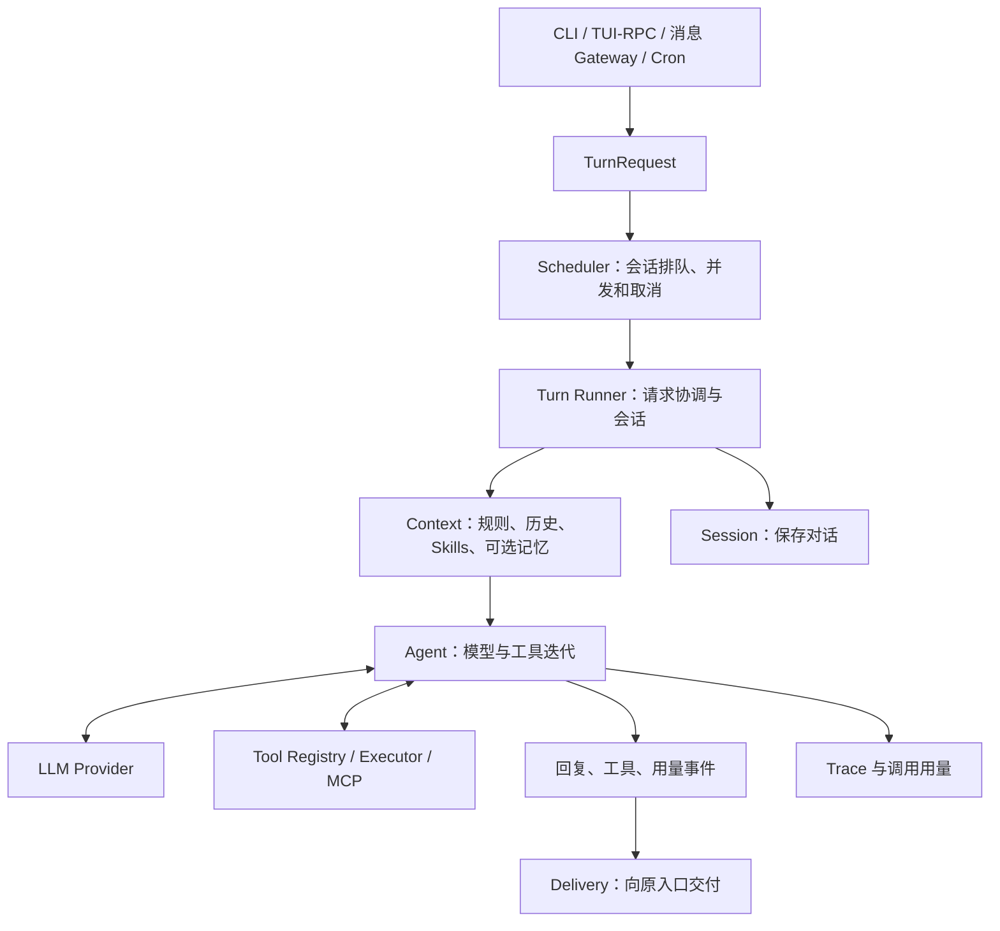

# 架构与代码归属

Pico 的 Python 运行时统一处理 CLI、TUI、消息渠道和定时任务。各入口把输入转换为请求，由调度器推进到上下文组装、模型调用、工具执行和结果交付；Node.js 应用负责终端与浏览器展示。

## 系统架构



## 模块职责

| 模块 | 负责内容 | 主要边界 |
| --- | --- | --- |
| `interfaces` | 输入输出与协议转换 | 入口复用同一运行时 |
| `bootstrap` | 创建 Provider、插件及宿主服务 | 按配置选择具体实现 |
| `contracts` | 请求、消息和事件 | 不依赖入口或 SDK |
| `runtime` | 执行、上下文、调度、会话和交付 | 维护任务与资源生命周期 |
| `capabilities` | 工具、技能、记忆与自动化 | 提供业务能力和协议 |
| `integrations` | 外部模型、渠道、MCP、执行器和插件 | 适配 SDK 与外部协议 |
| `observability` | Trace、Token 用量和成本 | 记录运行事实 |
| `security` | 权限与授权规则 | 判断操作是否允许 |
| `extensions` | 运行时评估与独立改进实验 | 通过 Hook 和协议接入 |
| `resources` | 模板、技能和前端资源 | 支持源码与独立安装定位 |
| `shared` | 基础 IO、锁、路径和算法 | 不依赖业务职责组 |

## 仓库结构

```text
pico-harness/
├── src/pico/                 # Python 产品代码
│   ├── bootstrap/           # 服务装配、Provider 创建和工作区初始化
│   ├── config/              # 配置加载、路径与 models/
│   ├── contracts/           # 请求、消息与运行事件
│   ├── interfaces/          # cli/、rpc/、gateway/
│   ├── runtime/             # agent/、context/、scheduling/、sessions/
│   │                        # delivery/、lifecycle/、hooks/
│   │                        # subagents/、personalization/
│   ├── capabilities/        # tools/、skills/、memory/、automation/
│   ├── integrations/        # llm/、channels/、mcp/、execution/、plugins/
│   ├── observability/       # tracing/、usage/
│   ├── security/            # authorization/
│   ├── extensions/          # evaluation/、evolution/
│   ├── resources/           # 内置 templates/、skills/ 和打包资源
│   └── shared/              # 路径、锁、原子 IO 和基础算法
├── apps/                    # tui/、tracing-viewer/
├── tests/                   # unit/、contracts/、integration/、e2e/
│                            # packaging/、tooling/、fixtures/
├── benchmarks/              # 评测工具、计划和任务输入
├── scripts/                 # ci/、dev/、release/、install/
├── examples/                # 示例配置与工作流
├── docs/                    # 安装、使用、配置、架构、测试和排障
├── LICENSES/                # 第三方许可证原文
└── .github/                 # CI、Issue 表单和 PR 模板
```

虚拟环境、缓存和本地运行数据由 Git 忽略。运行时提示词、Skill 和评测任务卡是程序输入，分别留在所属资源或任务目录。

## Agent 请求流程

```text
入口创建请求
  -> 按会话排队
  -> 读取会话并组装上下文
  -> 调用模型
  -> 执行工具并将结果加入消息
  -> 继续迭代或产生终态
  -> 保存对话、记录调用并交付结果
```

对应源码：

1. CLI、RPC、消息渠道或 Cron 创建 `contracts/turns.py` 中的 `TurnRequest`，携带来源、会话和忙时策略。
2. `runtime/scheduling/scheduler.py` 按会话建立执行 Lane，控制排队、并发和取消。
3. `runtime/agent/turn_adapter.py` 调用 Agent 的 `run_turn`，`turn_runner.py` 取得会话并处理入站流程。
4. `runtime/context/assembler.py` 组装规则、技能、可选记忆、历史与本轮输入。
5. `runtime/agent/execution.py` 调用模型。模型提出工具请求时，Pico 执行工具，把结果加入消息后继续下一轮。
6. `runtime/agent/streaming.py` 处理增量文本和流式工具参数；Turn Runner 保存消息并输出统一事件。
7. Scheduler 产生任务终态，Delivery 将结果交给对应出口。资源启动和关闭由 `runtime/agent/resources.py` 管理。

同一会话的任务串行，其他会话按并发限制执行。取消传播给当前任务；中途注入在迭代边界处理。Agent 的一个实例拥有工具注册表、会话服务及执行资源，拆出的函数显式接收该实例。

## 文件与函数归属

以下路径均相对于 `src/pico`：

| 职责 | 所属位置 |
| --- | --- |
| CLI 参数、终端显示、RPC 编解码 | `interfaces` |
| Provider 创建 | `bootstrap/providers.py` |
| 宿主服务装配与插件选择 | `bootstrap/container.py` |
| 请求、消息与事件类型 | `contracts` |
| 排队、并发和取消 | `runtime/scheduling` |
| 模型与工具迭代 | `runtime/agent/execution.py` |
| 请求协调、保存和输出事件 | `runtime/agent/turn_runner.py` |
| 流式文本与工具参数 | `runtime/agent/streaming.py` |
| 执行资源启动和关闭 | `runtime/agent/resources.py` |
| 上下文选择、预算与历史窗口 | `runtime/context` |
| 文件、命令、网页与交互工具 | `capabilities/tools` |
| 技能发现、解析、检索与选择 | `capabilities/skills` |
| 记忆存储与记录选择 | `capabilities/memory/consolidation/store.py` |
| 模型生成记忆注释与画像 | `capabilities/memory/consolidation/annotation.py` |
| 记忆文本解析与格式化 | `capabilities/memory/consolidation/formatting.py` |
| 记忆提取工具参数 | `capabilities/memory/consolidation/tool_schemas.py` |
| 会话归档触发策略 | `capabilities/memory/consolidation/consolidator.py` |
| 模型、消息、MCP、执行器与插件适配 | `integrations` |
| Trace、Token 用量与成本 | `observability` |
| 权限校验与授权策略 | `security/authorization` |
| 评估 Hook 与独立改进实验 | `extensions` |
| 内置模板、技能与前端资源定位 | `resources` |
| 无业务依赖的基础 IO、锁和算法 | `shared` |

函数首先放在业务所属模块。私有辅助函数与调用方放在一起，只有多个调用方确实需要相同语义时才提取。文件按职责命名，避免堆积宽泛的工具函数集合。

Python 模块和函数使用 `snake_case`，类使用 `PascalCase`，内部符号以 `_` 开头。Protocol 和业务类型放在所属能力模块，跨模块消息约定放在 `contracts`。

## 依赖边界

- `contracts` 不依赖入口、装配层或外部 SDK。
- `runtime` 不导入 CLI、RPC 或装配层；各入口复用同一执行机制。
- `capabilities`、`integrations` 和 `observability` 不依赖具体用户入口。
- `shared` 不导入其他 Pico 职责组。
- 产品源码不直接依赖 `tests`、`scripts` 或 `benchmarks`。

Protocol 和业务类型留在所属能力模块，真正跨模块的消息约定放入 `contracts`。仅用于类型提示的依赖使用 `TYPE_CHECKING`。网络连接和后台任务通过显式生命周期创建与关闭。

`extensions/evaluation` 通过 Hook 观察运行过程，`extensions/evolution` 运行独立的候选改进实验；仓库级 `benchmarks` 提供评测工具。三者各自维护生命周期。

架构检查通过 `uv run python -m scripts.ci.check_architecture` 执行。它检查静态导入边界，动态插件还需契约测试。

## 源码阅读入口

| 关注点 | 文件 |
| --- | --- |
| 命令注册与默认 TUI 入口 | [app.py](../../src/pico/interfaces/cli/app.py) |
| 宿主装配 | [container.py](../../src/pico/bootstrap/container.py) |
| 按会话调度 | [scheduler.py](../../src/pico/runtime/scheduling/scheduler.py) |
| 请求协调 | [turn_runner.py](../../src/pico/runtime/agent/turn_runner.py) |
| 模型与工具循环 | [execution.py](../../src/pico/runtime/agent/execution.py) |
| 上下文组装 | [assembler.py](../../src/pico/runtime/context/assembler.py) |

先沿一条请求理解调用关系，再阅读具体工具或外部适配器。测试与边界验证见[测试指南](../development/testing.md)。
